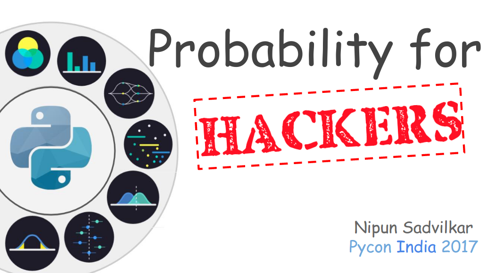

# Probability for Hackers - Pycon India 2017

### Description (Proposal for conference talk)

Did you just say probability? Mathematics at a tech conference? This mathematical term tends to elicit very strong reactions (either positive or negative, depending on who you ask) since it has a reputation for being difficult to crack/to keep track: it revolves around a seemingly endless jargon, abstract concepts, Greek letters as notations and more. Each concept holds its own subtle assumptions and everything is interlinked with each other. I know you have had enough of mathematics in the university but the way it is being taught is somewhat isolated from its practical application (less of a hands-on experience and more emphasis on theory) even though we encounter probability and statistics in our daily life. So, I am giving a go at ‘hacking the probability using code'.

We live in a world of ‘**Big Data**’ today. No matter how large or complex a dataset is, it provides only incomplete information about the questions that interest us. This incomplete information leads to uncertainty. This is where ‘probability’ comes into picture. Probability is “The Science of Uncertainty”. It gives us ways to quantify uncertainty and use it as one of the primary methods for designing new algorithms to model complex data. We use a computer to make predictions about new and/or uncertain events. These algorithms are nothing but Machine Learning techniques that provide automated methods of data analysis. In fact, all of us have already been users of these techniques. To name a few – Automated Spam Detection and filtering in e-mails, product/video recommendation (e.g., "customers who bought/watched ***X*** are also likely to buy/watch ***Y*** "). All of these are applications of probability in computer science. Most of machine learning techniques are rooted in probabilistic methods and we use it in many forms such as to know what is the best prediction about the future given/considering some past data? What is the best model to explain some data? What measurement should I perform next? etc. This is why it is important to learn probability.

In this talk, I will discuss how you can use your coding skills to "hack probability" – to replace some of the theory and jargon with intuitive computational approaches. My intention here is not to explain any concept precisely, but to merely lay down enough of them on the table to emphasize the role of probability in the fast growing areas such as **Artificial Intelligence** (superset of **Machine Learning** and **Deep Learning**), and **Data Science**.

> “Not once, but twice AI was revolutionized by people who understood Probability Theory” 
 
-Stanford University | CS 109: Probability for Computer Scientists

#### Talk Structure

1. Introduction 
     a. About me 
     b. Questions to know audience 
     c. Motivation

2. Talk's Target
3. Diving into Probability (interactive way) 
     a. Coin toss experiment using JQuery 
     b. Comparing theoretical Vs experimental probability with D3js 
     c. Simulating coin-toss experiment with Python 

4. Ingredients to Modelling Uncertainty 
     a. Sample space 
     b. Axioms of Probability 

5. Introduction to Random Variables

6. Relation between Random Variables 
     a. Joint Probability 
     b. Marginal Probability 
     c. Conditional Probability 
     d. Dependence & Independence

7. Demystifying Bayes' Theorem

8. Application of Probability Theory 
     a. Naive Bayes Algorithm for Spam filtering 

9. Take Away message

10. Thank you

11. References

